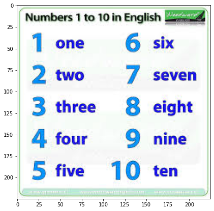
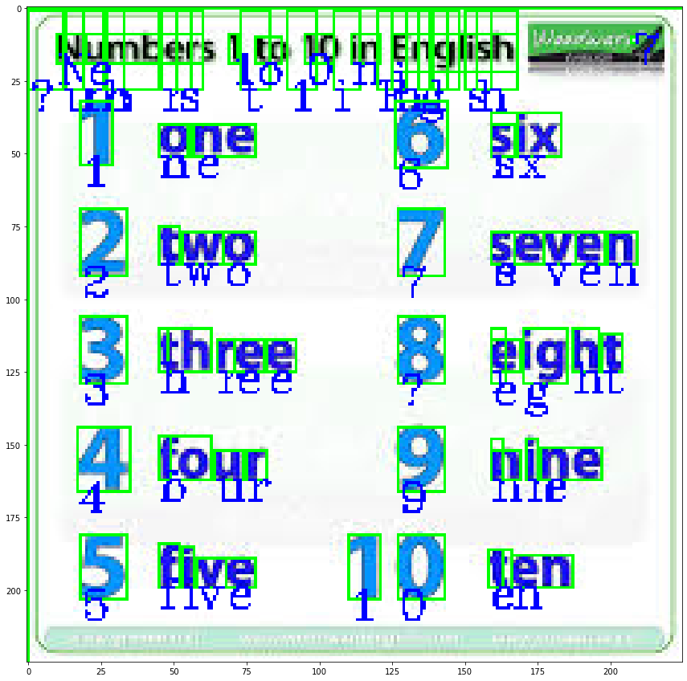

# Computer-Vision

This Repository contains, every projects and important concepts in the computer vision. So anyone can easily refer and understand it.

<h3> OCR with Pytesseract </h3>
*  You can find the code in the file of ocr_pytesseract.ipynb
<h2> Results </h2>

                                                     
